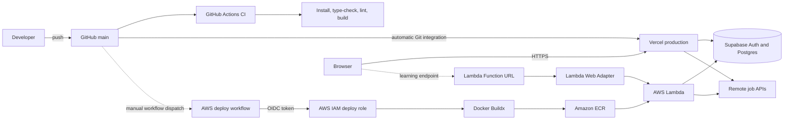

# jobbr

[](https://github.com/ca15y/jobbr/actions/workflows/ci.yml)
[](https://github.com/ca15y/jobbr/actions/workflows/deploy-aws.yml)
[](LICENSE)

**Live application:** [jobbr-five.vercel.app](https://jobbr-five.vercel.app)

Jobbr is a private-by-default job application workspace for tracking opportunities
and finding remote engineering roles. It is designed for candidates in Nigeria while
keeping its role and location filters extensible.

This repository is also a DevOps and cloud engineering portfolio project. The Next.js
application is the workload used to practise containerization, infrastructure as code,
CI/CD, keyless cloud authentication, serverless deployment, observability, rollback,
and cost-aware operations.

## What Jobbr does

- Tracks Saved, Applied, Interviewing, Offer, Accepted, Rejected, Withdrawn, and No response stages
- Syncs applications across devices with per-user Supabase Row Level Security
- Supports passwordless email authentication and GitHub OAuth in the application code
- Records application status history automatically
- Combines remote listings from Remotive and Jobicy, with optional Adzuna results
- Prioritizes Nigeria, Africa, EMEA, and worldwide eligibility signals
- Falls back to a populated preview workspace when Supabase is not configured

## DevOps objectives

Jobbr demonstrates:

- Reproducible Next.js builds with Node.js 24 and `npm ci`
- Continuous integration with GitHub Actions
- Automatic production delivery through Vercel
- Multi-stage Docker builds and a non-root runtime user
- Container delivery through Amazon ECR
- A serverless Next.js runtime on AWS Lambda using the Lambda Web Adapter
- Infrastructure provisioning with Terraform
- Keyless GitHub-to-AWS authentication with OpenID Connect (OIDC)
- Least-privilege IAM roles scoped to one repository, ECR repository, and Lambda function
- CloudWatch logging, deployment health checks, image retention, and rollback
- Separation of stateless compute from persistent identity and data

## Architecture



Vercel and GitHub CI react to the same push independently. CI validates the commit,
while Vercel performs its own build and deployment. CI is not currently configured as
a formal Vercel deployment gate; adding that control is part of the roadmap.

## Deployment environments

| Environment | Purpose | Release trigger | Artifact/runtime | Persistent state |
| --- | --- | --- | --- | --- |
| Local Next.js | Development | `npm run dev` | Local Node.js process | Supabase |
| Vercel | Primary public application | Push to `main` | Vercel-managed Next.js runtime | Supabase |
| AWS Lambda | DevOps learning lab | Manual GitHub Actions workflow | `linux/amd64` container from ECR | Supabase |

The AWS environment is intentionally manual. This prevents documentation-only commits
from repeatedly consuming AWS credits and creates a useful exercise in release control
and configuration drift.

## CI/CD pipelines

### Continuous integration

[`.github/workflows/ci.yml`](.github/workflows/ci.yml) runs for pushes and pull
requests targeting `main`:

1. Checks out the exact commit.
2. Installs the locked dependency graph with `npm ci`.
3. Runs TypeScript checks.
4. Runs ESLint.
5. Creates a production Next.js build.

A failed CI run does not modify Vercel, AWS, or Supabase.

### Vercel delivery

Vercel watches `main` through its GitHub integration. It installs dependencies, reads
the project environment configuration, builds the Next.js application, and promotes a
successful production deployment. Pull requests receive isolated preview deployments.

### AWS delivery

[`.github/workflows/deploy-aws.yml`](.github/workflows/deploy-aws.yml) is started
manually and performs the following release:

1. Requests a signed GitHub OIDC token.
2. Exchanges that token for a short-lived AWS role session.
3. Authenticates Docker to the private ECR repository.
4. Builds a `linux/amd64` image with Docker Buildx.
5. Pushes both an immutable Git commit tag and the moving `latest` tag.
6. Updates Lambda to the commit-tagged image.
7. Waits for the function update and checks the deployed `/login` route.

No long-lived AWS access key is stored in GitHub.

## AWS infrastructure as code

[`infra/aws`](infra/aws) contains the Terraform configuration for:

- A private, AES-256-encrypted ECR repository with scan-on-push enabled
- An ECR lifecycle policy that keeps the five newest images
- A Lambda execution role limited to its CloudWatch log stream operations
- A GitHub OIDC provider, unless an existing provider is supplied
- A repository- and environment-scoped GitHub deployment role
- A CloudWatch log group with seven-day retention
- A 1,024 MB, 30-second, `x86_64` Lambda container function
- A public Lambda Function URL using response streaming

Provisioning uses two stages because Lambda cannot reference a container image before
one exists:

```text
Terraform bootstrap → ECR and IAM → push bootstrap image → Terraform Lambda apply
```

Terraform manages infrastructure changes. GitHub Actions manages normal application
image releases. Local Terraform state and variable files are deliberately ignored
because they may contain deployment values.

## Container and Lambda runtime

The [`Dockerfile`](Dockerfile) uses separate dependency, build, and runtime stages.
Next.js `output: "standalone"` produces a reduced Node.js server bundle, which runs as
an unprivileged `nextjs` user on port `8080`.

The AWS Lambda Web Adapter translates Lambda Function URL events into ordinary HTTP
requests for that Node.js server. Lambda is stateless and may replace an instance at
any time; durable user data therefore remains in Supabase rather than the container
filesystem or process memory.

## Security model

- Only the Supabase publishable key is exposed to browser code.
- Supabase Row Level Security ties each application row to the authenticated user ID.
- Supabase service-role and secret keys must never enter browser variables or source control.
- GitHub Actions receives temporary AWS credentials through OIDC.
- The OIDC trust policy matches Jobbr's immutable GitHub owner and repository IDs and the `aws-production` environment.
- The deployment role can push only to Jobbr's ECR repository and update only Jobbr's Lambda function.
- The Lambda Function URL is publicly reachable, while protected application routes enforce Supabase authentication.
- `.env.local`, Terraform variables, plans, and state are excluded from Git.

See [`supabase/migrations/001_initial_schema.sql`](supabase/migrations/001_initial_schema.sql)
for the database schema and Row Level Security policies.

## Observability, rollback, and cleanup

The AWS workflow performs a post-deployment health check against `/login`. Runtime
logs are retained in CloudWatch for seven days and can be followed with:

```bash
aws logs tail /aws/lambda/jobbr --follow --region us-east-1
```

Every AWS image is tagged with its Git commit SHA. To roll back, select a known-good
tag from ECR and update Lambda to that image. A rollback changes application code but
does not roll back Supabase data.

The complete rollback procedure is in [`docs/ci-cd.md`](docs/ci-cd.md). When the AWS
lab is no longer needed, review a destroy plan and use the documented Terraform
cleanup procedure.

## Cost awareness

- Vercel Hobby and Supabase Free are used for the primary personal deployment.
- The AWS environment can consume credits through ECR storage, Lambda requests,
  CloudWatch logs, and data transfer; it is not guaranteed to remain at exactly $0.
- ECR retains only five images and CloudWatch retains seven days of logs.
- The AWS deployment is manual to avoid unnecessary builds and invocations.
- AWS Budgets should be configured before repeated experiments. A budget sends alerts;
  it is not a hard spending cap.

## Repository map

```text
src/app/                    Next.js routes, pages, route handlers, and server actions
src/components/             Product interface components
src/lib/supabase/           Browser, server, and proxy Supabase clients
supabase/migrations/        Database schema and Row Level Security policies
.github/workflows/          CI and AWS deployment automation
infra/aws/                  Terraform-managed AWS infrastructure
Dockerfile                  Multi-stage Lambda-compatible application image
docs/                       Architecture, CI/CD, and deployment runbooks
```

## Run locally

Requirements: Node.js 24 and npm.

```bash
git clone https://github.com/ca15y/jobbr.git
cd jobbr
npm ci
cp .env.example .env.local
npm run dev
```

Open [http://localhost:3000](http://localhost:3000). Without Supabase values, Jobbr
starts in preview mode so the interface can be explored immediately.

## Connect Supabase

1. Create a project in the [Supabase dashboard](https://supabase.com/dashboard).
2. Run `supabase/migrations/001_initial_schema.sql` once in the SQL Editor.
3. Copy the project URL and publishable key into `.env.local`:

```dotenv
NEXT_PUBLIC_SUPABASE_URL=https://your-project.supabase.co
NEXT_PUBLIC_SUPABASE_PUBLISHABLE_KEY=your-publishable-key
```

4. Add `http://localhost:3000/auth/callback` under **Authentication → URL Configuration**.
5. Restart the development server and request a new sign-in link.

The default Supabase email provider is intended for initial testing and has strict
recipient and rate limits. GitHub OAuth is the simplest public sign-in method for a
free deployment. Custom SMTP remains an optional production enhancement.

## Optional job source

Remotive and Jobicy require no credentials. To add Adzuna:

```dotenv
ADZUNA_APP_ID=your-app-id
ADZUNA_APP_KEY=your-app-key
ADZUNA_COUNTRIES=za,gb,us
```

Adzuna is supplemental because its API is country-based and has no Nigeria-specific
market endpoint. Jobbr marks uncertain eligibility for review.

## Deployment guides

- [Architecture and request flow](docs/architecture.md)
- [CI/CD and rollback](docs/ci-cd.md)
- [Vercel production deployment](docs/deployment/vercel.md)
- [AWS Lambda learning environment](docs/deployment/aws-lambda.md)

## Current status and roadmap

Working now:

- Vercel production deployment
- Supabase passwordless email authentication
- Per-user synchronized application data
- GitHub Actions CI
- Terraform-provisioned AWS Lambda environment
- Keyless manual AWS deployment through GitHub OIDC

Still to complete or improve:

- Supply GitHub OAuth application credentials in Supabase for the hosted deployment
- Add browser-level authentication and application end-to-end tests
- Make CI a formal production deployment gate
- Move Terraform state to a remote encrypted backend when the project outgrows local state
- Add a custom domain and transactional SMTP only when the public use case requires them
- Add shared caching if job-feed traffic grows beyond the current personal-use workload

## Verify a change

```bash
npm run typecheck
npm run lint
npm run build
```

## Contributing and security

Contributions are welcome. Read [`CONTRIBUTING.md`](CONTRIBUTING.md) before opening a
pull request. Report vulnerabilities using [`SECURITY.md`](SECURITY.md), not a public
issue.

## License

[MIT](LICENSE) © 2026 ca15y. The license permits use, modification, and redistribution
while preserving the copyright and license notice. It does not grant access to another
user's Jobbr data.
