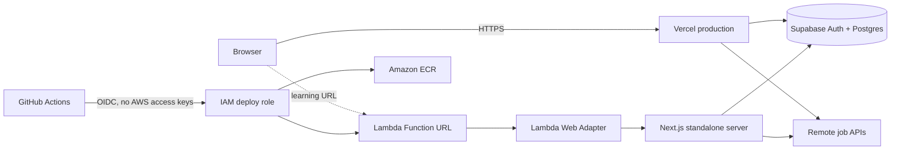

# Architecture

Jobbr separates the application runtime from identity and persistent data. The same source can run on Vercel or inside a Lambda-compatible container without changing the product code.

## Runtime choices

Jobbr uses capabilities that require a server:

- Supabase sessions stored in HTTP cookies
- Next.js route handlers and proxy logic
- Server Components and server actions
- Server-side job-feed aggregation

That rules out GitHub Pages, which only serves static files. Vercel runs these Next.js features natively. For AWS practice, `output: "standalone"` creates a small Node.js server bundle, and the AWS Lambda Web Adapter translates Function URL events into ordinary HTTP requests for that server.

## Data boundary

Supabase is the system of record. Every user-owned table has Row Level Security policies tied to the authenticated user ID. Vercel and Lambda are stateless compute layers; replacing a deployment does not replace application data.

The remote feed cache is process-local. Lambda instances are short-lived, so a cold instance may fetch feeds again. A later version could add a shared cache, but it is unnecessary for the first personal-use release.

## Deployment environments

| Environment | Purpose | Trigger | Persistent state |
| --- | --- | --- | --- |
| Local Next.js | Development | `npm run dev` | Supabase project |
| Vercel | Public demo and primary app | Push to `main` | Supabase project |
| AWS Lambda | DevOps learning lab | Manual GitHub Actions workflow | Supabase project |

Keeping AWS deployment manual avoids consuming credits for every documentation edit. CI still validates every push and pull request.

## Security model

- Browser code receives only the Supabase publishable key.
- Database policies, not key secrecy, protect each user's rows.
- GitHub Actions requests a short-lived AWS credential through OIDC.
- The AWS trust policy is restricted to `aws-production` and Jobbr's immutable GitHub owner/repository IDs, not names alone.
- The deployment role can push only to the Jobbr ECR repository and update only the Jobbr Lambda function.
- Terraform state and local environment files are ignored because they can contain deployment values.
